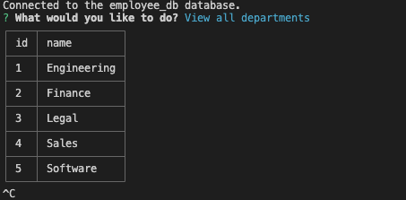
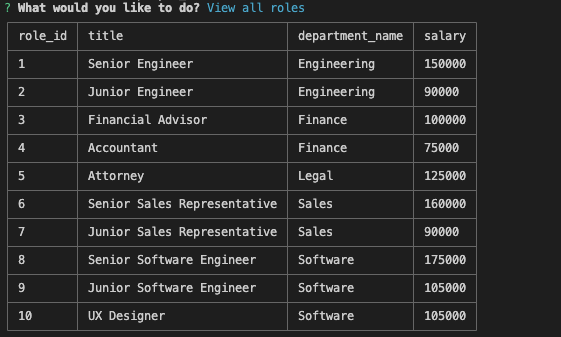
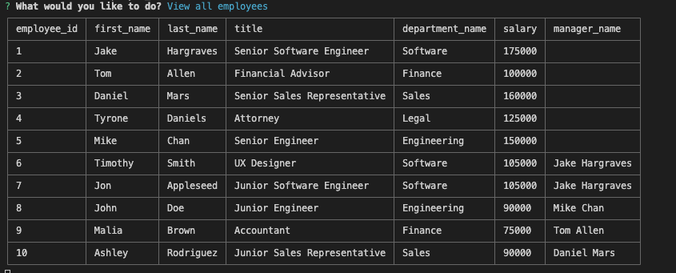

# Employee Database

## Description

This is a NodeJS application that allows a user to create a database for employee information as well as access and update that information.  The application allows the user to select commands from the terminal to access, create, or update employee information.  The user is also able to create new departments in the database.  In this project I learned a lot about how to execute MYSQL queries including UPDATE and JOIN.

## Table of Contents

- [Installation](#installation)
- [Usage](#usage)
- [Credits](#credits)
- [License](#license)

## Installation

In order to use this application, the user would have to download the files locally and use their mysql information.

## Usage

link to video tutorial: https://drive.google.com/file/d/1pATk8Su3E1o79wkNn6cdW0SpZCxA113S/view

The user will need to create the databases required for this application.
To use this application, simply open the terminal and navigate to the employee-database folder.  Then enter the command "node index.js" and the user will be prompted with a list of commands.  Select the desired command and then follow the prompts.

## Credits

node packages: 
- inquirer
- mysql2
- cli-table3
- dotenv

## License

View license in Repository

## Features

- view all departments 
- view all roles 
- view all employees 
- add a department 
- add a role 
- add an employee
- update an employee role